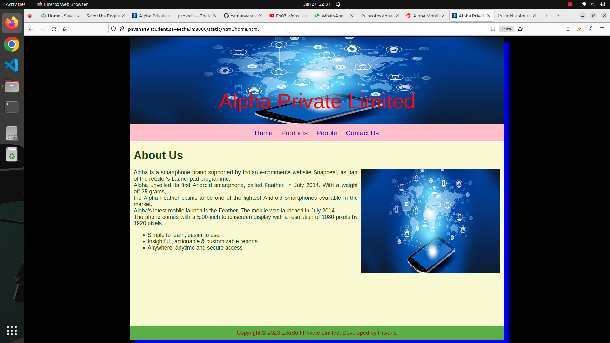
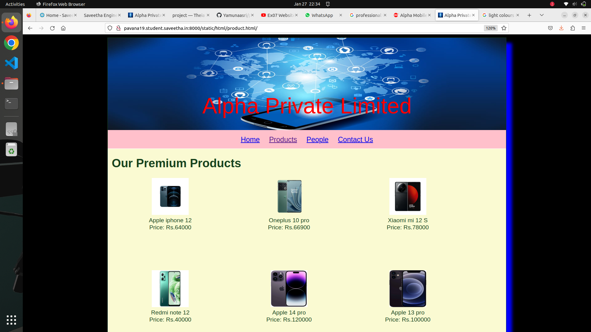
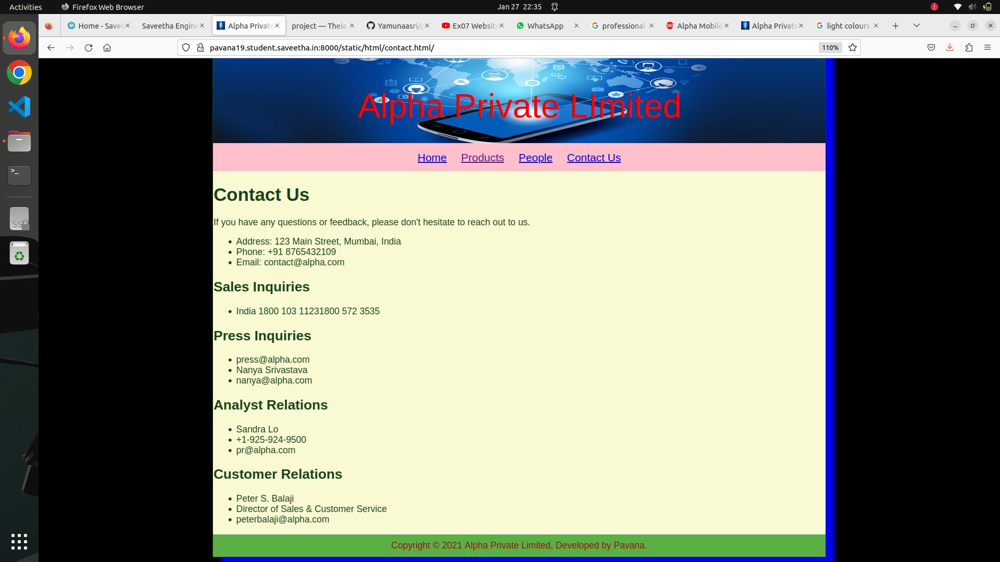
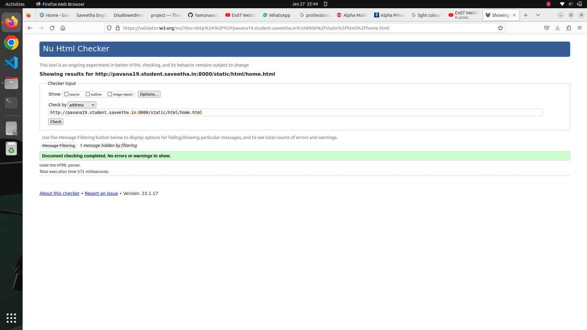

# Web Design for a Software Product Company

## AIM:

To design a static website for a software product company company.

## DESIGN STEPS:

### Step 1:

Requirement collection.

### Step 2:

Creating the layout using HTML and CSS.

### Step 3:

Updating the sample content.

### Step 4:

Choose the appropriate style and color scheme.

### Step 5:

Validate the layout in various browsers.

### Step 6:

Validate the HTML code.

### Step 6:

Publish the website in the given URL.

## PROGRAM :

HOME.HTML

<!DOCTYPE html>
<html lang="en">
  <head>
    <title>Alpha Private Limited</title>
    
    
    <link rel="stylesheet" href="/static/css/layout.css">
    <link rel="icon" href="/static/img/index.jpeg" type="image/x-icon">
  </head>

  <body>
    

      
Alpha Private Limited

      
      

        
<a href="/home/">Home</a>

        
<a href="/products/">Products</a>

        
<a href="/people/">People</a>

        
<a href="/contactus/">Contact Us</a>

      

      

        

          <h1>About Us</h1>
          
          

           Alpha is a smartphone brand supported by Indian e-commerce website Snapdeal, as part of the retailer's Launchpad programme.  
           Alpha unveiled its first Android smartphone, called Feather, in July 2014. With a weight of125 grams, 
           the Alpha Feather claims to be one of the lightest Android smartphones available in the market. 
           Alpha's latest mobile launch is the Feather. The mobile was launched in July 2014. 
           The phone comes with a 5.00-inch touchscreen display with a resolution of 1080 pixels by 1920 pixels. 

            <ul>
              <li>Simple to learn, easier to use</li>
              <li>Insightful , actionable & customizable reports</li>
              <li>Anywhere, anytime and secure access</li>
            </ul>
          

        

      

      

        Copyright &#169; 2023 EduSoft Private Limited, Developed by Pavana
      

    

  </body>
</html>

PRODUCT.HTML

 <!DOCTYPE html>
<html lang="en">
  <head>
    <title>Alpha Private Limited</title>
     <link rel="stylesheet" href="/static/css/layout.css">
    <link rel="icon" href="/static/img/index.jpeg" type="image/x-icon">
    
  </head>

  <body>
    

      
Alpha Private Limited

      

     
<a href="/home/">Home</a>

        
<a href="/products/">Products</a>

        
<a href="/people/">People</a>

        
<a href="/contactus/">Contact Us</a>

      

      

        
    
          <h1>Our Premium Products</h1>
          

              
 
                  

                  
                  

                  
Apple iphone 12

                  
Price: Rs.64000 

              

              
 
                  

                  
                  

                  
Oneplus 10 pro

                  
Price: Rs.66900

              

              
 
                  

                  
                  

                  
Xiaomi mi 12 S

                  
Price: Rs.78000 

              

              
 
                  

                  
                  

                  
Redmi note 12

                  
Price: Rs.40000 

              

              
 
                  

                  
                  

                  
Apple 14 pro

                  
Price: Rs.120000

              

              
 
                  

                  
                  

                  
Apple 13 pro

                  
Price: Rs.100000 

              

              
 
                  

                  
                  

                  
apple 14 pro 128 gb

                  
Price: Rs.126000 

              

              
 
                  

                  
                  

                  
Redmi 12 

                  
Price: Rs.50000 

              

              
 
                  

                  
                  

                  
one plus 14 pro

                  
Price: Rs.75000

              

              
 
                  

                  
                  

                  
xiaomi 15 pro

                  
Price: Rs.90000 

              

      

      

        Copyright &#169; 2021 Alpha Private Limited, Developed by Pavana.
      

    

  </body>
</html>

CONTACT.HTML

<!DOCTYPE html>
<html lang="en">
  <head>
    <title>Alpha Private Limited</title>
   <link rel="stylesheet" href="/static/css/layout.css">
    <link rel="icon" href="/static/img/index.jpeg" type="image/x-icon">
     
  </head>

  <body>
    

      
Alpha Private LImited

      

        
<a href="/home/">Home</a>

        
<a href="/products/">Products</a>

        
<a href="/people/">People</a>

        
<a href="/contactus/">Contact Us</a>

      

      

          
            <h1>Contact Us</h1>
  
If you have any questions or feedback, please don't hesitate to reach out to us.

  <ul>
    <li>Address: 123 Main Street, Mumbai, India</li>
    <li>Phone: +91 8765432109</li>
    <li>Email: contact@alpha.com</li></ul>
  
<h2> Sales Inquiries</h2>

<ul><li>India 1800 103 11231800 572 3535</li></ul>
    <h2>Press Inquiries</h2> 
<ul><li>press@alpha.com</li>

<li>Nanya Srivastava</li>
<li>nanya@alpha.com</li></ul>
    <h2>Analyst Relations</h2> 

    <ul><li>Sandra Lo</li>
    <li>+1-925-924-9500</li>
    <li>pr@alpha.com</li></ul>
        <h2>Customer Relations</h2> 

    <ul><li>Peter S. Balaji</li>
    <li>Director of Sales & Customer Service</li>
    <li>peterbalaji@alpha.com</li>
    </ul>
    
  

   

        Copyright &#169; 2021 Alpha Private Limited, Developed by Pavana.
      

      

</body>
</html>

PEOPLE.HTML

<!DOCTYPE html>
<html lang="en">
  <head>
    <title>Alpha Private Limited</title>
    
     <link rel="stylesheet" href="/static/css/layout.css">
    <link rel="icon" href="/static/img/index.jpeg" type="image/x-icon">
    
  </head>

  <body>
    

      
Alpha Private Limited.

      

        
<a href="/home/">Home</a>

        
<a href="/products/">Products</a>

        
<a href="/people/">People</a>

        
<a href="/contactus/">Contact Us</a>

      

      

        
    
          <h1>PEOPLE AT EDUSOFT</h1>
          

              
 
                  

                  
                  

                  
SALIL PARAKH

                  
Managing Director 

              

              
 
                  

                  
                  

                  
NANDAN NELAKENI

                  
Co-founder and Chairman of the Board 

              

              
 
                  

                  
                  

                  
KIRAN MAZUMDAR

                  
Executive officer 

              

              
 
                  

                  
                  

                  
D.SASHA

                  
Marketing manager 

              

              
 
                  

                  
                  

                  
Lily Bloom

                  
 Financial Officer 

              

          

          
        
      

      

        Copyright &#169; 2021 Alpha Private Limited, Developed by Pavana.
      

    

  </body>
</html>

LAYOUT.CSS

* {
  box-sizing: border-box;
  font-family: Arial, Helvetica, sans-serif;
}
body {
  background-color:black;
  color: #17421d;
}
.container {
  width: 1080px;
  margin-left: auto;
  margin-right: auto;
  border-width: 1px 1px 1px 1px;
  border-style: solid;
  box-shadow: 15px 15px 8px blue;
}

.banner {
  display: block;
  width: 100%;
  height: 250px;
  text-align: center;
  font-size: 60px;
  background-image: url("/static/img/index.jpeg");
  background-size: 100% 100%;
  margin: 0px 0px 0px 0px;
  padding-top: 150px;
  color:red;
}

.menu {
  display: block;
  width: 100%;
  height: 50px;
  font-size: larger;
  background-color:pink;
  text-align: center;
  padding-top: 15px;
  margin: 0px 0px 0px 0px;
  border-width: 1px;
}

.menuitem {
  display: inline-block;
  margin-left: 10px;
  margin-right: 10px;
}
.menuitemselected {
  display: inline-block;
  margin-left: 10px;
  margin-right: 10px;
  color: blue;
}

.menuitem a {
  text-decoration: none;
  color: #9c1018;
}

.content {
  display: block;
  width: 100%;
  background-color:lightgoldenrodyellow;
  min-height: 500px;
  margin: 0px 0px 0px 0px;
  border-width: 1px;
  border-color: white;
  border-style: solid;
}
.homecontent {
  min-height: 500px;
  margin: 10px 10px 10px 10px;
}
.homecontent h1 {
  text-align: left;
}
.homecontent img {
  float: right;
  width: 400px;
  height: 300px;
  margin-left: 10px;
}

.contenttext {
  text-align: justify;
}

.productcontent {
  min-height: 500px;
  margin: 10px 10px 10px 10px;
}

.productcontent h1 {
  text-align: left;
}

.productitems {
  display: block;
}

.productitem {
  display: inline-block;
  width: 30%;
  height: 250px;
  text-align: center;
}

.productitem img {
  width: 100px;
  height: 100px;
  display: block;
}
.productitem .itemimage {
  display: block;
  margin-left: auto;
  margin-right: auto;
  width: 100px;
  margin-bottom: 5px;
}

.productitem .itemname {
  display: block;
}
.productitem .itemprice {
  display: block;
}

.footer {
  display: block;
  width: 100%;
  height: 40px;
  background-color: #5bb045;
  text-align: center;
  padding-top: 10px;
  margin: 0px 0px 0px 0px;
  color: #9c1018;
}

## OUTPUT:

## HTML VALIDATOR:

## Result:

Thus a website is designed for the software product company and the HTML,CSS code are validated.
